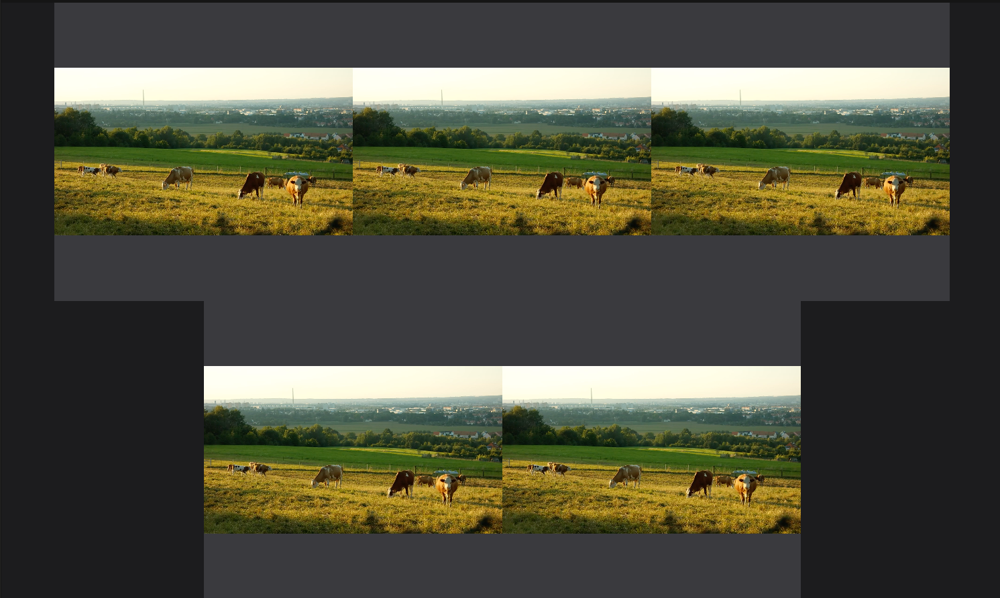

## Update
I posted a fun **part 2**, where I am building the same UI using experimental CSS Layout API from CSS Houdini 🎩. 

[Check it out!](../zoom-video-gallery-p2)


## TLDR
Complete solution is [here](https://codesandbox.io/s/zoom-video-gallery-600ks). Change videos count and resize the screen to see it in action.

<iframe src="https://codesandbox.io/embed/zoom-video-gallery-600ks?fontsize=14&hidenavigation=1&runonclick=1&view=preview"
style="border:0; border-radius: 4px; overflow:hidden;" width="1280" height="720"
title="ZOOM video gallery"
allow="accelerometer; ambient-light-sensor; camera; encrypted-media; geolocation; gyroscope; hid; microphone; midi; payment; usb; vr; xr-spatial-tracking"
sandbox="allow-forms allow-modals allow-popups allow-presentation allow-same-origin allow-scripts"
></iframe>


----

## Intro

Hi folks 👋

I had to build a video gallery view similar to the one ZOOM has for Meetter.

I've spent quite a bit of time trying to figure out how to build it with pure CSS and I... FAILED 😕.

Sharing my current solution with
* a bit of JavaScript
* CSS custom properties
* `display: flex`

If someone has an idea on how to achieve similar result without using JavaScript, please share 🙏

## Problem

Having `videoCount` videos with fixed `aspectRatio` and fixed container size (`containerWidth`, `containerHeight`), fit all the videos inside the container to occupy as much area as possible. Videos should have the same size and can't overflow the container.

## Solution

### Calculating size for a video

First I needed to make sure videos are not overflowing the container and occupying as much area as possible.

```ts
function calculateLayout(
    containerWidth: number,
    containerHeight: number,
    videoCount: number,
    aspectRatio: number
  ): { width: number; height: number, cols: number } {
 // see implementation in codesandbox
}
```

Current implementation brute-force searches the layout which occupies the most of the available space. It compares the sum of video areas for every possible number of columns.

```ts
// pseudocode, see codesandbox for complete version
let bestArea;
for (let cols = 1; cols <= videoCount; cols++) {
   const currentArea = /* sum of video areas in this layout */
   if (bestArea < currentArea) {
      bestArea = currentArea;
   }
}
```
> There is also a npm module that does just that! [github](https://github.com/fzembow/rect-scaler)

> But is there a better way then brute-force? Does it worth it if we assume the maximum `videoCount` is 50? 🤔

### Markup, styles & CSS custom properties

The HTML structure I went with:

```html
<body>
    <div id="gallery">
      <div class="video-container">
        <video></video>
      </div>
      <div class="video-container">
        <video></video>
      </div>
    </div>
</body
```

I applied calculated `width` and `height` to `.video-container`.

```scss
.video-container {
  width: var(--width);
  height: var(--height);
}
```

I used CSS custom properties to pass values calculated in JavaScript.

```ts
const gallery = document.getElementById('gallery');
gallery.style.setProperty("--width", width + "px");
gallery.style.setProperty("--height", height + "px");
gallery.style.setProperty("--cols", cols + "");
```

> ⚠️  Don't forget to recalculate these values when the screen size or number of videos changes.

Then I used `display: flex` to layout `.video-container` elements

```scss
#gallery {
  display: flex;
  justify-content: center;
  flex-wrap: wrap;
  max-width: calc(var(--width) * var(--cols));
}
``` 

As `.video-container` sizes are calculated to fit into the container, I didn't have to worry about anything else here.
I also found `justify-content: center;` to work best for the use case, as it nicely centers not fully filled rows.
The purpose of `max-width` is to force line breaks.

#### Handling different aspect ratios

This gallery has a constraint of a fixed aspect ratio for all elements. But videos could have different ratios. This is where having `.video-container` wrapping `<video/>` is handy.

```scss
.video-container {
  width: var(--width);
  height: var(--height);
}

video {
  height: 100%;
  width: 100%;
}
```

This way `video` occupies as much space as possible within its container and preserves its original aspect ratio.

For example, changing the ratio of a container from `16:9` to `1:1` doesn't distort videos with the original `16:9` ratio.




### Result

This is how it looks in the real world:


Check out the complete solution [here](https://codesandbox.io/s/zoom-video-gallery-600ks). Change videos count and resize the screen to see it in action.

<iframe src="https://codesandbox.io/embed/zoom-video-gallery-600ks?fontsize=14&hidenavigation=1&runonclick=1&view=preview"
style="border:0; border-radius: 4px; overflow:hidden;" width="1280" height="720"
title="ZOOM video gallery"
allow="accelerometer; ambient-light-sensor; camera; encrypted-media; geolocation; gyroscope; hid; microphone; midi; payment; usb; vr; xr-spatial-tracking"
sandbox="allow-forms allow-modals allow-popups allow-presentation allow-same-origin allow-scripts"
></iframe>

### Open questions❓

1. Is it possible to achieve a similar result without calculating video size in JavaScript? 🤔
2. Is there a better way of calculating video sizes than brute-force search? Is it worth it if a number of videos can't exceed 50? 🤔


