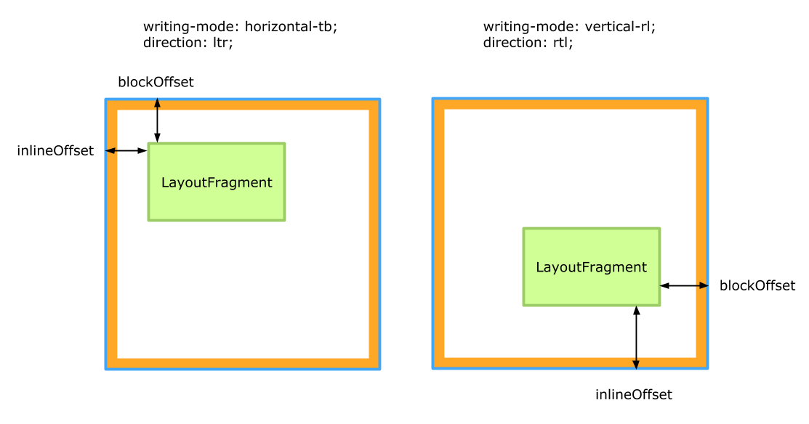

## TLDR

Complete solution is [here](https://codesandbox.io/s/zoom-like-gallery-with-css-houdini-0nb1m).

> ⚠️ This demo uses experimental API. Check browser [support](https://ishoudinireadyyet.com) before using in production.

If you use Chrome, make sure you have `experimental-web-platform-features` flag enabled. Check support for other browsers [here](https://ishoudinireadyyet.com).

<iframe src="https://codesandbox.io/embed/zoom-like-gallery-with-css-houdini-0nb1m?fontsize=14&hidenavigation=1&runonclick=1&view=preview"
style="border:0; border-radius: 4px; overflow:hidden;" width="1280" height="720"
title="ZOOM video gallery"
allow="accelerometer; ambient-light-sensor; camera; encrypted-media; geolocation; gyroscope; hid; microphone; midi; payment; usb; vr; xr-spatial-tracking"
sandbox="allow-forms allow-modals allow-popups allow-presentation allow-same-origin allow-scripts"
></iframe>

Video in case you use a browser without `CSS Layout API` support:

<iframe src="https://player.vimeo.com/video/426310990" width="1280" height="720" frameborder="0" allow="autoplay; fullscreen; picture-in-picture" allowfullscreen></iframe>

---

## Intro

Hi there 👋

[Last week I've built a video gallery just like in ZOOM](../zoom-video-gallery-p1).

I tried to find a solution using with pure CSS, but failed. This week I still don't have a pure CSS solution. Instead, I rebuilt the video gallery using experimental [CSS Layout API](https://drafts.css-houdini.org/css-layout-api/) from CSS Houdini 🎩.

## Problem


image from zoom.us

Having `videoCount` videos with fixed `aspectRatio` and fixed container size (`containerWidth`, `containerHeight`), fit all the videos inside the container to occupy as much area as possible. Videos should have the same size and can't overflow the container.

## CSS Houdini 🎩

CSS Houdini is a set of experimental browser APIs which allow to hook into browser rendering process. We are going to use [CSS Layout API](https://drafts.css-houdini.org/css-layout-api/) for positioning and sizing video elements.

> ⚠️ This API is available only with experimental flag. So it can't be used in production just yet!

## Solution

Starting from following HTML structure:

```html
<div id="gallery">
  <div class="video-container">
    <video />
  </div>
  <div class="video-container">
    <video />
  </div>
</div>
```

And making sure `#gallery` takes up the whole screen:

```css
body {
  margin: 0;
  height: 100vh;
}
#gallery {
  height: 100%;
}
```

### display: layout(zoom-like-gallery)

This is the moment where Houdini 🎩 does his magic:

```css
#gallery {
  height: 100%;
  display: layout(zoom-like-gallery); // 💥
}
```

Normally we would use `display` property with one of predefined values. Like `grid`, `flex` or `inline-block`. But `CSS Layout API` allows developers to implement their custom layouts 😱. And we are going to implement our custom `zoom-like-gallery` layout.

```js
// check for CSS Layout API support
if ("layoutWorklet" in CSS) {
  // import a module with our custom layout
  CSS.layoutWorklet.addModule("zoom-like-gallery-layout.js")
}
```

Then in `zoom-like-gallery-layout.js` we register a layout:

```js
registerLayout(
  "zoom-like-gallery",
  class {
    // array of CSS custom properties that belong to the container (to the `#gallery` in our case)
    // look at this like at parameters for custom layout
    // we will use this later to make aspect ratio configurable from CSS
    static get inputProperties() {
      return []
    }

    // array of CSS custom properties that belong to children (to `.video-container` elements in our case).
    static get childrenInputProperties() {
      return []
    }

    // properties for layout,
    // see: https://drafts.css-houdini.org/css-layout-api/#dictdef-layoutoptions
    static get layoutOptions() {}

    // allows to define min-content / max-content sizes for a container (for `#gallery` in our case).
    // see: https://drafts.csswg.org/css-sizing-3/#intrinsic-sizes
    async intrinsicSizes(children, edges, styleMap) {}

    // finally function to perform a layout
    // (`children` is an array of `.video-container` elements in our case)
    async layout(children, edges, constraints, styleMap) {}
  }
)
```

⬆️ The API is complex, but to reach the goal we can just focus on `layout` function. This is where we have to write the code for sizing and positioning video elements. Browser will call this function whenever it needs to perform the layout.

```js

async layout(children, edges, constraints, styleMap) {
  const containerWidth = constraints.fixedInlineSize; // width of a `#gallery`. Equals to the width of the screen in our case.
  const containerHeight = constraints.fixedBlockSize; // height of a `#gallery`. Equals to the height of the screen in our case.
  const videosCount = children.length;
  const aspectRatio = 16 / 9; // hardcode this for now. will improve later
```

If you followed the original [post](../zoom-video-gallery-p1), you may notice we have the same input parameters as we had in original solution. So we can reuse the layout algorithm from the original post to calculate the gallery layout.

```js
async layout(children, edges, constraints, styleMap) {
  const containerWidth = constraints.fixedInlineSize; // width of a `#gallery. Equals to the weight of the screen in our case.
  const containerHeight = constraints.fixedBlockSize; // height of a `#gallery`. Equals to the height of the screen in our case.
  const videosCount = children.length;
  const aspectRatio = 16 / 9; // just hardcode this for now

  // `calculateLayout` finds layout where equally sized videos with predefined aspect ratio occupy the largest area
  // see implementation in codesandbox https://codesandbox.io/s/zoom-like-gallery-with-css-houdini-0nb1m?file=/layout.js:1840-2787
  // see explanation in the original post
  const { width, height, cols, rows } = calculateLayout(containerWidth, containerHeight, videosCount, aspectRatio);
  // width: fixed width for each video
  // height: fixed height for each video
}
```

Now when we have fixed `width` and `height` for all video elements, we can layout them using:

```js
// layout video containers using calculated fixed width / height
const childFragments = await Promise.all(
  children.map(child => {
    return child.layoutNextFragment({
      fixedInlineSize: width,
      fixedBlockSize: height,
    })
  })
)
```

`layoutNextFragment()` is part of [CSS Layout API](https://drafts.css-houdini.org/css-layout-api/#layout-children). It performs layout on child elements (`.video-container` in our case). It returns children as an array of [LayoutFragments](https://drafts.css-houdini.org/css-layout-api/#layout-fragments).

At this point all videos inside a container are laid out with sizes we calculated. The only thing left is to position them within a container (`#gallery`).

Positioning `childFragments` within the container is done by by setting its `inlineOffset` and `blockOffset` attributes. If not set by the author they default to zero.


image from [here](https://drafts.css-houdini.org/css-layout-api/#layout-fragments)

```js
childFragments.forEach(childFragment => {
  childFragment.inlineOffset = // assign x position for a video container
  childFragment.blockOffset = // assign y position for a video container
})

return { childFragments }; // finish layout function by returning childFragments
```

Refer to [codesandbox](https://codesandbox.io/s/zoom-like-gallery-with-css-houdini-0nb1m?file=/layout.js:907-1651) for implementation ⬆️.

On this point everything should work, but we can make it a bit better. We hardcoded `aspectRatio` inside the layout code:

```
const aspectRatio = 16 / 9;
```

To make this configurable from CSS:

```js
static get inputProperties() {
  return ["--aspectRatio"];
}

async layout(children, edges, constraints, styleMap) {
  const containerWidth = constraints.fixedInlineSize;
  const containerHeight = constraints.fixedBlockSize;
  const videosCount = children.length;
  // const aspectRatio = 16 / 9;
  const aspectRatio = parseFloat(styleMap.get("--aspectRatio").toString());

  // ...
  return childFragments
}
```

And now pass it from CSS:

```css
#gallery {
  height: 100%;
  display: layout(zoom-like-gallery);
  --aspectRatio: 1.77; /* 16 / 9 */ 👈
}
```

That's a wrap 🥇. Working solution is [here](https://codesandbox.io/s/zoom-like-gallery-with-css-houdini-0nb1m). If you use Chrome, make sure you have `experimental-web-platform-features` flag enabled. Check support for other browsers [here](https://ishoudinireadyyet.com).

<iframe src="https://codesandbox.io/embed/zoom-like-gallery-with-css-houdini-0nb1m?fontsize=14&hidenavigation=1&runonclick=1&view=preview"
style="border:0; border-radius: 4px; overflow:hidden;" width="1280" height="720"
title="ZOOM video gallery"
allow="accelerometer; ambient-light-sensor; camera; encrypted-media; geolocation; gyroscope; hid; microphone; midi; payment; usb; vr; xr-spatial-tracking"
sandbox="allow-forms allow-modals allow-popups allow-presentation allow-same-origin allow-scripts"
></iframe>

Video in case you use a browser without CSS Layout API support:

<iframe src="https://player.vimeo.com/video/426310990" width="1280" height="720" frameborder="0" allow="autoplay; fullscreen; picture-in-picture" allowfullscreen></iframe>

### How does it different from the original solution?

Both implementations use the same algorithm to calculate the layout for the `#gallery`.

Nevertheless, there are a couple of notable differences:

1. When `#gallery` layout is recalculated.
2. What triggers the recalculation.
3. How `#gallery` layout values propagate to the screen.

In the [original implementation](../zoom-video-gallery-p1), we added a debounced event listener to the `resize` event on a `window`. We recalculated the gallery layout on a main thread whenever an event fired. Then we changed CSS using calculated layout values and this triggered browser rendering engine to re-layout videos for new screen dimensions.

```
resize event -> recalculate -> change CSS -> browser performs re-layout
```

In the implementation with `CSS Layout API`, browser rendering engine calls `layout()` on its own whenever it decides it needs to recalculate the layout for `#gallery`. We didn't have to listen for resizes and didn't have to manually manipulate DOM. **Our code to calculate layout for the `#gallery` is being executed as part of a browser rendering engine process**. Browser _may even decide_ to execute it in a separate thread leaving less work to perform on the main thread, and our UI may become more stable and performant 🎉.

## Conclusion

Unfortunately, we can't deploy this to production just yet ([support](https://ishoudinireadyyet.com)). Have to leave [original implementation](./zoom.jpg) for now. But future is exciting! Developers soon will have an API to hook into browser rendering engine making their apps more stable and performant!

## Learn more

- [Practical overview of CSS Houdini](https://www.smashingmagazine.com/2020/03/practical-overview-css-houdini/)
- [Houdini: Demystifying CSS](https://developers.google.com/web/updates/2016/05/houdini)
- [ishoudinireadyyet.com](https://ishoudinireadyyet.com)
- [CSS Layout API examples](https://github.com/GoogleChromeLabs/houdini-samples/tree/master/layout-worklet)
- [CSS Layout API spec](https://drafts.css-houdini.org/css-layout-api/#layout-children)
- I skipped the concept of [Worklets](https://www.smashingmagazine.com/2020/03/practical-overview-css-houdini/#worklets) trying to keep this hands-on post simpler.
